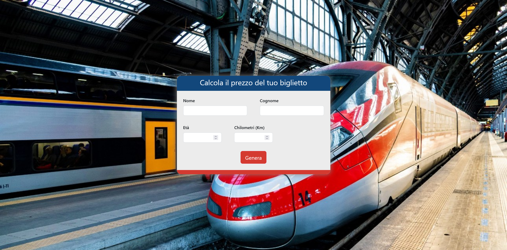
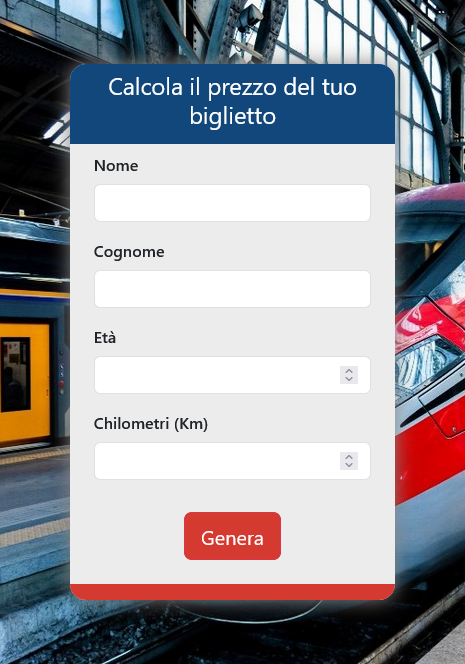

# Boolean - js-pwdgen-wannabe

This is a solution to the js-pwdgen-wannabe challenge of [Boolean](https://boolean.careers/). Boolean help you improve your coding skills by building realistic projects with an increasingly high level of difficulty. 

## Table of contents

- [Overview](#overview)
  - [The challenge](#the-challenge)
  - [Screenshot](#screenshot)
    - [Index](#index)
    - [Errors](#errors)
    - [Ticket](#ticket)
    - [Mobile](#mobile)
  - [Links](#links)
- [My process](#my-process)
  - [Built with](#built-with)
- [Author](#author)

## Overview

### The challenge

Users should be able to:

- View the optimal layout depending on their device's screen size
- See hover states for interactive elements
- Fill the fields and generate a train ticket with random train ID, cab and place

### Screenshot

#### Index

#### Errors

#### Ticket

#### Mobile

### Links

- Solution URL (Github): [https://github.com/totarochristian/js-biglietto-treno-form](https://github.com/totarochristian/js-biglietto-treno-form)
- Live Site URL (Vercel): [https://js-biglietto-treno-form-9ntcurhhs-totarochristian.vercel.app](https://js-biglietto-treno-form-9ntcurhhs-totarochristian.vercel.app)

## My process

### Built with

- Semantic HTML5 markup
- CSS custom properties
- Flexbox
- Media Queries
- Bootstrap
- Plane Javascript

## Author

- GitHub - [@totarochristian](https://github.com/totarochristian)
- Frontend Mentor - [@totarochristian](https://www.frontendmentor.io/profile/totarochristian)
- Linkedin [Christian Totaro](https://www.linkedin.com/in/christian-totaro-080a7018a/)